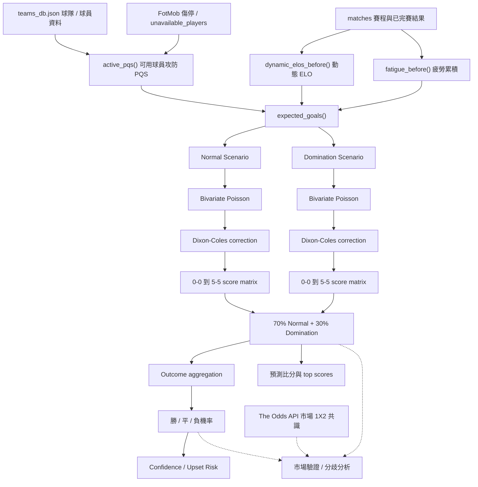
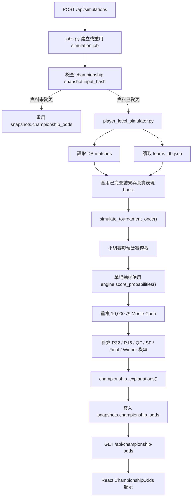
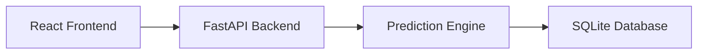
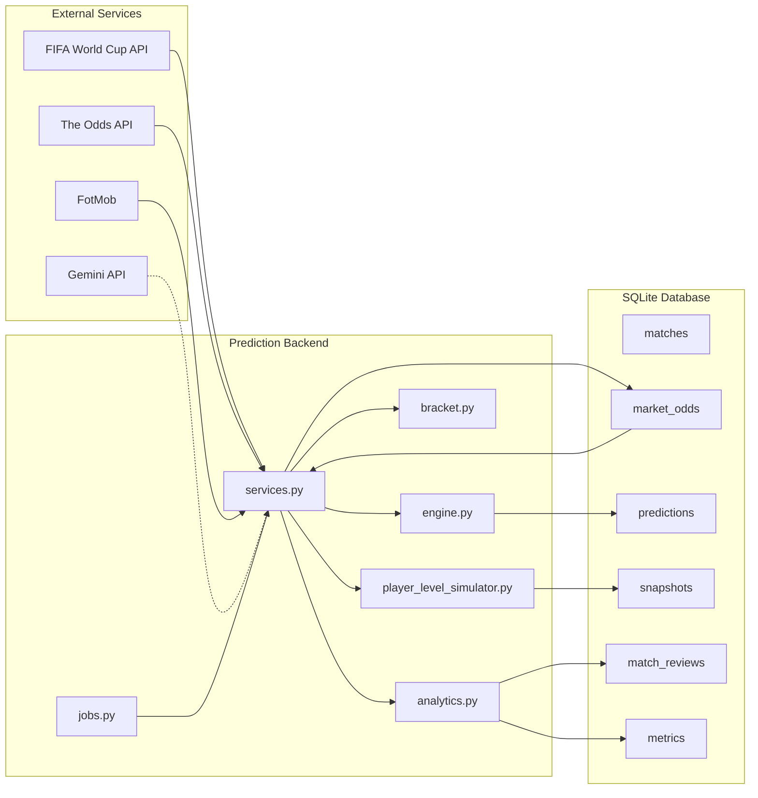

# 🏆 FIFA Predictor 4.0

FIFA Predictor 4.0 是一個針對 2026 FIFA 世界盃打造的智慧預測與賽事模擬平台。

系統結合 Player Quality Score（PQS）球員評分模型、ELO 強度評估、傷停與疲勞影響分析、雙變量泊松（Bivariate Poisson）比分模型、Dixon-Coles 修正以及 10,000 次 Monte Carlo Simulation，提供單場比賽預測、淘汰賽推演、奪冠機率分析、風險評估、賽後模型驗證與外部市場共識參考。

除了預測結果外，系統亦提供模型回測、命中率統計、失準原因解析與模型表現追蹤，讓預測結果具備可解釋性與可驗證性。

---

## 🌍 線上展示

Demo：

https://fifa-2026-predictor-4.onrender.com

> 首次開啟可能需要 30~60 秒喚醒 Render Free Instance。

---

## ⭐ 專案亮點

### ⚽ 預測模型

- Player Quality Score（PQS）球員評分模型
- ELO Rating 球隊強度評估
- 傷停球員動態影響分析
- 球員疲勞累積模型
- 主辦國優勢修正
- 球風相剋（Matchup Style Effect）
- Bivariate Poisson 雙變量泊松比分模型
- Dixon-Coles 低比分修正
- 完整比分機率矩陣（0–0 ~ 5–5）
- 勝 / 平 / 負機率預測
- 預測信心與爆冷風險評估

### 🏆 賽事模擬

- FIFA 2026 全新 48 隊賽制支援
- 小組賽 + 淘汰賽完整模擬
- 10,000 次 Monte Carlo Simulation
- 奪冠機率預測
- 即時淘汰賽推演
- 奪冠熱門解讀系統

### 📊 模型分析與市場驗證

- 預測信心等級
- 爆冷風險分析
- 賽後模型檢討
- 預測與實際結果比較
- 模型失準原因解析
- 命中率與回測統計
- The Odds API 市場 1X2 共識參考
- 模型 vs 市場機率分歧排行
- 市場熱門比分推估
- 市場資料僅作外部參考，不取代模型主預測

### 🚀 工程實作

- FastAPI 後端架構
- React + Vite 前端
- Snapshot Cache 快取機制
- Background Job System
- World Cup API 整合
- FotMob 資料同步
- Render 雲端部署
- Simulation 效能優化 67.9%＝約 3.1x 加速

---

## 📸 系統畫面

### 首頁預測

> 


### 奪冠模擬

> 


### 奪冠熱門解讀

> 


### 賽後模型檢討

> 
> 


---

## 🧠 單場預測流程



---

## 🏆 奪冠模擬流程



> 註：FIFA 2026 小組第三名分配目前在 `bracket.py` 使用 constraint search 與 provisional fallback；尚未寫成完整官方 lookup table。

---

## 🧠 模型技術細節

### Expected Goals Estimation

系統首先根據球員品質（PQS）、ELO 強度、傷停影響、疲勞狀態、主辦國優勢以及球風相剋等因素估計雙方期望進球（Expected Goals）。

模型同時建立：

- Normal Scenario（正常情境）
- Domination Scenario（壓制情境）

最終以：

```text
70% Normal
30% Domination
```

進行混合。

---

### Bivariate Poisson Score Model

比分機率矩陣使用 Bivariate Poisson（雙變量泊松）建立。

相較於傳統獨立泊松模型，雙變量泊松允許雙方進球存在共同變動因素，使比賽結果更符合真實足球比賽特性。

目前共同進球參數：

```text
γ = 0.08
```

模型產生：

```text
0-0 ～ 5-5
共 36 個比分結果
```

完整比分機率矩陣。

---

### Dixon-Coles Correction

足球比賽中的低比分結果（尤其 0-0、1-0、0-1、1-1）往往無法被標準泊松模型正確描述。

因此模型額外套用 Dixon-Coles Correction：

```text
ρ = -0.05
```

針對低比分區域進行機率修正，提高平局與低比分比賽的預測合理性。

---

### Outcome Aggregation

勝、平、負機率並非獨立計算。

系統先建立完整比分矩陣，再透過機率加總得到：

- Home Win
- Draw
- Away Win

最終輸出的勝平負機率與預測比分皆來自同一套比分分布模型。

---

## 📈 市場共識分析

系統可選擇性串接 The Odds API，取得世界盃賽事的 1X2 市場資料，並將其作為「外部參考訊號」呈現。市場資料不會直接取代模型預測，也不會改寫 ELO、xG、PQS、Poisson 或 Monte Carlo 模型輸出。

### 資料來源與儲存

- 後端於同步流程中呼叫 `fetch_market_evidence()`，向 The Odds API 取得 `soccer_fifa_world_cup` 的 `h2h` 市場。
- 只讀取勝 / 平 / 負（1X2）賠率，使用 decimal odds，查詢區域為 `eu,uk`。
- 每家 bookmaker 的賠率會先做去水位（devig）轉成隱含機率。
- 多家 bookmakers 的 home / draw / away 機率以 median 建立市場共識，再重新正規化。
- 市場 snapshot 儲存在 SQLite 的 `market_odds` table，payload 內包含 `consensus`、`bookmaker_count`、`last_update`、`snapshot_status`、`locked`、`confidence` 等欄位。
- 比賽開賽後，若已有開賽前市場 snapshot，系統會將其標記為 locked，避免用賽後才取得的市場資料回填賽前分析。

### 模型 vs 市場差異

單場預測仍先由模型產生勝平負機率與比分矩陣；市場資料只在預測結果旁邊做驗證與比較：

- 後端會計算 `value_scores`，代表模型機率與市場共識之間的百分點差距。
- 前端「市場共識」卡片會顯示模型與市場的最大分歧。
- 「分歧排行」會依 home / draw / away 三種結果的差距絕對值排序。
- 「市場熱門比分」會把市場 1X2 共識套到模型比分條件分布上，推估市場觀點下較熱門的比分。
- 分歧會被標示為高度一致、輕微分歧或明顯分歧，但不會輸出下注建議。

> 註：目前系統有模型與市場的差異分數、分歧排行與熱門比分推估；沒有實作獨立的投注型「Value Opportunity」推薦模組。

### API Key 與 fallback

若要啟用即時市場同步，需要設定：

```text
THE_ODDS_API_KEY=your_api_key
```

若未設定 `THE_ODDS_API_KEY`，`fetch_market_evidence()` 會直接回傳空資料，同步流程仍可正常完成；單場預測會顯示「目前沒有可用的市場資料」，模型預測、賽後檢討與奪冠模擬仍照常運作。

---

## 🏗️ 技術架構

### Frontend

- React
- Vite
- JavaScript
- CSS

### Backend

- FastAPI
- SQLAlchemy
- SQLite
- Python

### Data Sources

- FIFA World Cup API
- FotMob
- The Odds API（若設定 `THE_ODDS_API_KEY`，用於 1X2 市場共識驗證）
- Gemini（若設定 `GEMINI_API_KEY`，用於更新賽前 / 賽後文字分析）

### Local Seed / Fallback Data

- `teams_db.json`：球隊與球員資料來源
- `real_games_results.json`：首次啟動時匯入 matches 的 seed data
- `simulation_probabilities.json`：首次啟動時匯入 championship snapshot 的 seed data
- `match_analyses.json`：Gemini 未設定或無快取分析時的文字 fallback

### Deployment

- Render
- GitHub

---

## 🏗️ 系統架構



FIFA Predictor 採用前後端分離架構。

- React + Vite 負責使用者介面
- FastAPI 提供 REST API
- Prediction Engine 負責單場預測與奪冠模擬
- SQLite 儲存比賽、預測、模擬與回測資料

所有前端畫面皆透過 API 取得資料，不直接讀取資料庫或本地 JSON。

---

## 🧠 Prediction Engine Architecture



此架構描述預測引擎內部資料流與模組關係。

核心單場預測由 `engine.py` 完成，奪冠模擬由 `player_level_simulator.py` 執行，背景同步與模擬工作則由 `jobs.py` 管理。The Odds API 資料由 `market.py` 擷取、`services.py` 寫入 `market_odds`，再於單場預測時作為外部市場驗證訊號附加到 response。

---

## 📂 專案結構

```text
FIFA-2026-prediction-4.0
│
├── frontend
│   ├── src
│   │   ├── components
│   │   │   ├── ChampionshipOdds.jsx
│   │   │   ├── ModelPerformance.jsx
│   │   │   ├── NextMatchPredictor.jsx
│   │   │   └── TournamentBracket.jsx
│   │   ├── utils
│   │   ├── App.jsx
│   │   ├── api.js
│   │   ├── teams_db.json
│   │   ├── real_games_results.json
│   │   ├── simulation_probabilities.json
│   │   └── match_analyses.json
│   └── public
│
├── backend
│   ├── app
│   │   ├── main.py
│   │   ├── services.py
│   │   ├── engine.py
│   │   ├── jobs.py
│   │   ├── models.py
│   │   ├── db.py
│   │   ├── bracket.py
│   │   ├── analytics.py
│   │   ├── market.py
│   │   ├── fotmob.py
│   │   ├── config.py
│   │   └── schemas.py
│   ├── alembic
│   ├── archive
│   ├── data
│   ├── tests
│   ├── player_level_simulator.py
│   ├── generate_frontend_data.py
│   ├── optimize_c1_c2.py
│   └── sync_real_games.py
│
├── pyproject.toml
├── alembic.ini
├── render.yaml
└── README.md
```

---

## ⚡ 效能優化

### Monte Carlo Tournament Simulation

初始版本：

```text
10,000 次模擬
≈ 1444 秒
```

第一階段優化：

```text
10,000 次模擬
≈ 691 秒
```

改善幅度：

```text
約 52%
約 2.1x 加速
```

主要優化：

- Real Games Lookup Index
- PMF Cache
- Matrix Reuse
- Active PQS Cache

第二階段優化：

```text
10,000 次模擬
≈ 463 秒
```

額外改善：

```text
約 33.9%
```

最終總改善：

```text
1444 秒 → 463 秒

約 67.9% 改善
約 3.1x 加速
```

---

### 第一階段優化內容

#### Real Games Lookup Index

- 建立一次比賽索引
- 同時建立正向與反向 lookup key
- 保留 unavailable players 原本資料順序
- 避免大量線性搜尋

#### PMF Cache

- 預先快取 Poisson PMF
- score_matrix() 改為查表組合
- 不改變模型公式與結果

#### Matrix Reuse

- Normal 與 Domination rates 相同時重用 matrix
- 避免重複建立比分矩陣

#### Active PQS Cache

- Tournament run 建立獨立 cache
- 快取基礎 PQS 計算結果
- 疲勞修正仍維持動態計算

---

### 第二階段優化內容

- Snapshot Cache
- Compact Probability Matrix
- Fused Mix + Sampling
- Simulation Pipeline 精簡

---

## 📈 核心功能

### Match Prediction｜單場比賽預測

- 查看即將開賽賽事的勝 / 平 / 負機率
- 查看模型預測比分、Top scores 與完整 0–0 到 5–5 比分矩陣
- 檢視預期進球、ELO 差距、疲勞與傷停輸入
- 透過信心等級與爆冷風險理解模型判斷強度

### Market Consensus｜市場共識驗證

- 在設定 `THE_ODDS_API_KEY` 後同步 The Odds API 1X2 市場資料
- 顯示多家 bookmakers 去水位後的市場共識
- 比較模型機率與市場機率，呈現最大分歧與分歧排行
- 推估市場觀點下的熱門比分
- 市場資料僅作外部參考訊號，不取代模型預測

### Championship Simulation｜奪冠模擬

- 執行 10,000 次 Monte Carlo tournament simulation
- 查看各隊小組出線、淘汰賽各輪晉級與奪冠機率
- 顯示奪冠熱門 Top 5 與熱門球隊比較
- 使用 snapshot cache，在輸入資料未變時快速重用最新模擬結果

### Model Validation｜模型驗證

- 追蹤已完賽比賽的 1X2 命中率、Log Loss、Brier Score
- 查看 Top 3 比分命中率與 calibration buckets
- 將模型預測、實際結果與市場訊號分開保存，方便後續回測

### Post-Match Review｜賽後模型檢討

- 比較預測比分與實際比分
- 判斷勝負方向與比分是否命中
- 分析失準原因，例如市場訊號缺口、攻勢方向落差或高信心參數偏誤
- 保留規則式與 Gemini 文字分析 fallback，未設定 API key 時仍可顯示基本檢討

---

## 🔮 未來規劃

- 小組賽階段模型表現分析
- 淘汰賽階段模型表現分析
- 自動生成賽事報告
- 模型版本比較
- 長期預測回測系統
- AI 賽事解讀增強
- PostgreSQL 支援
- Background Worker 架構

---

## 👨‍💻 作者

劉耀升  
National Taiwan Ocean University  
Department of Computer Science and Engineering

GitHub：

https://github.com/wilson94624

---

## 📄 License

MIT License
